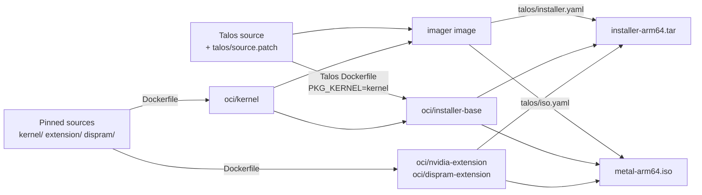

# Talos DGX kernel

Talos Linux **v1.14.1** for NVIDIA DGX Spark (arm64), built with:

- **Linux 6.17.13-talos-dgx1022.4**: Ubuntu `linux-nvidia-6.17` 6.17.0-1022.22 plus the
  patches in `kernel/patches/series`, configured by `kernel/config` with 64 KiB pages.
- **NVIDIA 580.178.04** open GPU kernel modules and **GPUDirect Storage 2.29.4**
  (`nvidia-fs`), packaged as the `nvidia-open-gpu-kernel-modules-lts` system extension.
- **dispram**: the `dispramd` service, which lends the 2046 MiB GB10 display carveout to
  CUDA processes ([dispram/README.md](dispram/README.md)).
- The upstream `nvidia-container-toolkit-lts` system extension.

## Page size

The kernel uses 64 KiB pages (`CONFIG_ARM64_64K_PAGES`), the page size of Ubuntu's
`nvidia-64k` flavour of the same source. The GPU runs on NVIDIA's open kernel modules,
built from `kernel-open/` in the driver archive; they initialize GB10 under 64 KiB pages,
as Ubuntu's `linux-modules-nvidia-580-open-*-nvidia-64k` packages do.

- Page descriptors (64 bytes per page) take 128 MiB per 128 GiB of RAM, against 2 GiB with
  4 KiB pages. Page tables have 3 levels for 48-bit virtual addresses.
- The contiguous memory allocator reserves 1024 MiB (`CONFIG_CMA_SIZE_MBYTES`), the value
  Ubuntu sets for `nvidia-64k`. Movable allocations also use that area.
- PMD-level transparent huge pages are 512 MiB. 2 MiB pages come from hugetlb
  (`hugepagesz=2M hugepages=<count>` on the kernel command line) and from multi-size THP
  (`/sys/kernel/mm/transparent_hugepage/hugepages-2048kB/enabled`).
- The kernel allocates memory in 64 KiB units, so each cached file and each small
  anonymous mapping occupies at least 64 KiB. Programs that assume a 4 KiB page size,
  such as jemalloc built with `--with-lg-page=12`, need builds for 64 KiB pages.
- Swap areas need `mkswap` under this kernel before use.

`extension/patches/` holds the driver patches, applied in `series` order:

- `0001-nvidia-uvm-flush-gpu-tlb-after-hub-ats-faults.patch` (Matt Mastracci): after
  servicing an ATS fault from a copy engine (HUB client), nvidia-uvm invalidates the GPU
  TLB on every page size. Upstream invalidates only on 4 KiB kernels, so on 64 KiB
  kernels a copy from pageable memory that faults on a freshly populated page faults
  again on the stale TLB entry and stalls. libcuda triggers this: before a pageable
  copy it populates `[align_down(start), align_down(start) + size)`, which leaves the
  last page unpopulated when `start` is unaligned.

Drivers from 590.44.01 on also need
[NVIDIA/open-gpu-kernel-modules#1269](https://github.com/NVIDIA/open-gpu-kernel-modules/issues/1269)
on 64 KiB kernels; 580.178.04 sizes DMA submaps for 64 KiB alignment, which 64 KiB pages
meet.

## Versions

The kernel release is `6.17.13-talos-dgx<ABI>.<revision>`:

- `<ABI>` is the Ubuntu `linux-nvidia-6.17` ABI number the source comes from (`1022`).
- `<revision>` counts this repository's kernel builds for that ABI. Raise it whenever the
  kernel changes: config, patches, sources, or toolchain.

Releases are tagged `<Talos version>-dgx<ABI>.<revision>`, for example
`v1.14.1-dgx1022.4`.

`uname -v` starts with `#<fingerprint>`: the first 12 hex digits of a SHA-256 over the files
the kernel build reads (`Dockerfile`, `kernel/config`, `kernel/patches/`, `scripts/`). The
`Makefile` computes it from the file contents, so any change to those files gives a new
fingerprint, and identical files give the same one on every machine.

## Outputs

`make` writes to `_out/`:

| File                  | Use                                                                    |
| --------------------- | ---------------------------------------------------------------------- |
| `installer-arm64.tar` | Installer image. Push it, then reference it from `machine.install.image` or `talosctl upgrade --image`. |
| `metal-arm64.iso`     | Bootable installation ISO.                                             |
| `SHA256SUMS`          | Checksums of the installer and the ISO.                                |
| `OCI-DIGESTS`         | Manifest digests of the images below; identical for identical inputs.  |
| `oci/kernel`          | Kernel image in the Talos `PKG_KERNEL` layout (OCI layout).            |
| `oci/nvidia-extension`| NVIDIA system extension image (OCI layout).                            |
| `oci/dispram-extension`| dispram system extension image (OCI layout).                          |
| `oci/installer-base`  | Talos installer base built for this kernel (OCI layout).               |

## How the build works



1. **Kernel and extensions** (`Dockerfile`, bake group `kernel`). BuildKit downloads the
   source archives by checksum, applies the patches, builds the kernel with the Sidero
   Labs LLVM toolchain, then builds the NVIDIA and GDS modules against the same tree, and
   `dispramd` against the RM headers of the same driver release. The stage scripts live
   in `scripts/`; each one checks its output (config, kernel release, module signatures
   and vermagic, symbol resolution, extension layout).
2. **Talos images** (bake group `talos`). Talos's own Dockerfile at the pinned commit,
   with `talos/source.patch` applied, builds `installer-base` and `imager` using the
   kernel image from step 1 as `PKG_KERNEL`.
3. **Boot assets**. The imager turns the installer base and both extensions into the
   installer image and the ISO, using the profiles in `talos/`.

Builds run natively on amd64 and arm64 hosts; the kernel always targets arm64.

| Path                    | Contents                                                     |
| ----------------------- | ------------------------------------------------------------ |
| `Makefile`              | Entry point and the cross-cutting pins (Talos version and commit, kernel release, `SOURCE_DATE_EPOCH`). |
| `Dockerfile`            | Kernel and NVIDIA extension stages, source URLs and checksums, toolchain images. |
| `docker-bake.hcl`       | Build targets, outputs, and the Talos build arguments with package images pinned by digest. |
| `scripts/`              | Stage scripts run inside the build.                         |
| `kernel/`               | Kernel config, patches, SPDX document, signing key template. |
| `extension/`            | NVIDIA extension manifest, modprobe policy, SPDX document.   |
| `dispram/`              | `dispramd` source, extension manifest and service definition. |
| `talos/`                | Talos source patch and imager profiles.                      |
| `.github/workflows/`    | CI build and release.                                        |

## Requirements

- Docker Engine or Docker Desktop with buildx. `make` creates a `docker-container`
  builder named `talos-dgx-kernel` running the pinned BuildKit version.
- GNU Make, Git, and OpenSSL. `crane` for `make push`, `gh` for `make release`.
- Memory and disk for the kernel build. The build uses every CPU the builder has. A
  builder with 12 CPUs and 24 GiB of memory builds it; 8 GiB runs out of memory while
  generating BTF. BuildKit state for one build takes about 30 GiB of disk.

## Module signing key

The kernel embeds the certificate of one signing key and enforces module signatures
(`module.sig_enforce=1`). Every build signs all modules, including the NVIDIA ones, with
this key. Keeping the key fixed makes builds reproducible and lets separately built
extensions load on the same kernel.

Create it once:

```sh
make signing-key   # writes keys/module-signing.pem (private key + certificate)
```

Store `keys/module-signing.pem` in your secret manager and add its contents as the
`MODULE_SIGNING_KEY` repository secret for CI. Use the same file for every build of a
release; `SIGNING_KEY=/path/to/key.pem` selects a key stored elsewhere.

## Build

```sh
make            # kernel, extension, Talos images, installer, ISO, SHA256SUMS, OCI-DIGESTS
```

Individual steps: `make kernel`, `make talos`, `make installer`, `make iso`. BuildKit
caches every stage, so repeated runs rebuild only what changed. `make clean` removes
`_out/` and the Talos checkout in `.work/`.

### Reproducibility

The same inputs and signing key produce the same kernel, NVIDIA extension, and
`installer-base` images. `make` writes their manifest digests to `_out/OCI-DIGESTS`.
Inputs are pinned as follows:

- Source archives by SHA-256 (`Dockerfile`), Talos by commit (`Makefile`).
- Every container image by digest: toolchain and validator (`Dockerfile`), Talos
  packages (`docker-bake.hcl`), container toolkit extension (`talos/*.yaml`), BuildKit
  and the Dockerfile frontend.
- `SOURCE_DATE_EPOCH` drives Kbuild timestamps, image metadata, and file times
  (`rewrite-timestamp=true` on every image output). Kbuild user and host are fixed in
  the toolchain stage, and the Kbuild version is the input fingerprint.

The Talos imager records the time it runs in two places: the installer image's
creation time, and the file times of the system extensions archive it appends to the
initramfs. Installers and ISOs from separate runs carry those timestamps and otherwise
hold the same content, so `SHA256SUMS` identifies one run's files and `OCI-DIGESTS`
identifies the build.

To check a build, run `make` again on another machine or a fresh builder
(`docker buildx prune --builder talos-dgx-kernel -af`) and compare `_out/OCI-DIGESTS`.

## Release

1. Raise the kernel revision when the kernel changed (see [Versions](#versions)), and commit.
2. Build with `make`.
3. Tag the commit and publish the release:

   ```sh
   git tag v1.14.1-dgx1022.4 && git push origin v1.14.1-dgx1022.4
   make release
   ```

`make release` creates the GitHub release for the tag with `installer-arm64.tar`,
`metal-arm64.iso`, `SHA256SUMS`, and `OCI-DIGESTS`. The release notes list the kernel
release, its `uname -v` fingerprint, the checksums, and the image digests.

Publishing the release runs `.github/workflows/publish.yaml`. It checks
`installer-arm64.tar` against `SHA256SUMS`, pushes it to
`ghcr.io/kindlingai/talos-dgx-kernel/installer:<tag>` with the workflow's `GITHUB_TOKEN`,
and adds the pushed `image@sha256:digest` reference to the release notes.

`make push` pushes the installer to any registry with `crane` and writes the pushed
reference to `_out/installer.ref`:

```sh
make push IMAGE=registry.example.com/talos/installer TAG=test
```

### CI

`.github/workflows/build.yaml` runs `make` for `v*` tags and manual dispatch on the
runner named by the `BUILD_RUNNER` repository variable, and uploads the outputs as a
workflow artifact. The job runs when that variable is set. The runner needs the memory
and disk listed under [Requirements](#requirements); GitHub's standard runners for
private repositories are smaller.

For a tag without a release, the job runs `make release`, then `publish.yaml`. For a tag
whose release already exists, the job compares its `OCI-DIGESTS` with the release's,
which checks that the release reproduces on that runner.

Repository setup:

- Secret `MODULE_SIGNING_KEY`: contents of `keys/module-signing.pem`.
- Variable `BUILD_RUNNER`: runner label for the build job.

## Install

Reference the installer image by digest, for example
`ghcr.io/kindlingai/talos-dgx-kernel/installer:v1.14.1-dgx1022.4@sha256:<digest>`. When
the package is private, give nodes pull credentials through
`machine.registries.config`.

The DGX Spark LAN port uses the Realtek `r8127` driver in this kernel. Select network
interfaces by MAC address (`deviceSelector.hardwareAddr`) so the configuration matches
the same port under any driver.

### New machine from the ISO

1. Write `metal-arm64.iso` to a USB drive and boot the Spark from it. Talos starts in
   maintenance mode with this kernel and its network drivers.
2. Point the machine configuration at the installer image:

   ```yaml
   machine:
     install:
       disk: /dev/nvme0n1
       image: ghcr.io/kindlingai/talos-dgx-kernel/installer:v1.14.1-dgx1022.4@sha256:<digest>
   ```

   `talosctl gen config ... --install-image <image>` sets the same field.
3. Apply it: `talosctl apply-config --insecure --nodes <ip> --file controlplane.yaml`.
   Talos installs from the installer image and reboots into the installed system.

### Upgrade a running Talos node

Upgrade one node at a time and confirm it is healthy before moving on. Keep a backup of
the node's configuration and a console path for recovery.

```sh
export TALOSCONFIG=/secure/path/to/talosconfig
NODE=node-address
INSTALLER=ghcr.io/kindlingai/talos-dgx-kernel/installer:v1.14.1-dgx1022.4@sha256:<digest>

talosctl --nodes "$NODE" read /proc/sys/kernel/random/boot_id

# Stage the upgrade, then drain and power-cycle the node.
talosctl --nodes "$NODE" upgrade --image "$INSTALLER" --no-reboot
talosctl --nodes "$NODE" reboot --mode powercycle --drain --wait

talosctl --nodes "$NODE" read /proc/version
talosctl --nodes "$NODE" read /proc/sys/kernel/random/boot_id
talosctl --nodes "$NODE" get linkstatus
talosctl --nodes "$NODE" get extensions
```

A healthy node reports kernel `6.17.13-talos-dgx1022.4` with the release's `uname -v`
fingerprint, a new boot ID, a working LAN link and default route, Kubernetes `Ready`, and
working NVIDIA GPU, CDI, and CUDA workloads.

## Talos source patch

`talos/source.patch` adapts Talos to this kernel:

- `DefaultKernelVersion` is `6.17.13-talos-dgx1022.4`, so Talos userspace looks up modules
  under that release.
- `hack/modules-arm64.txt` (the modules copied into the initramfs) adds `r8127` and
  drops six entries this kernel provides differently: `hkdf` is built in,
  `libie_fwlog` is part of `ice.ko`, `libeth_xdp`, `dwmac-sun55i`, and `pcs-rzn1-miic`
  are deselected in `kernel/config`, and `vmxnet3` requires 4 KiB or 16 KiB pages.

## Updating

| Change                     | Files                                                                     |
| -------------------------- | ------------------------------------------------------------------------- |
| Kernel source or patches   | `Dockerfile` (URLs, checksums), `kernel/patches/`, `kernel/config`, `kernel/kernel.spdx.json` |
| Kernel release (revision)  | `Makefile` (`KERNEL_RELEASE`), `kernel/config` (`CONFIG_LOCALVERSION`), `talos/source.patch`, `extension/manifest.yaml`, `dispram/manifest.yaml`, both SPDX documents |
| NVIDIA or GDS              | `Dockerfile` (checksums, including open-gpu-kernel-modules), `docker-bake.hcl` (versions), `extension/` (rebase `extension/patches/`), `dispram/manifest.yaml` |
| Talos                      | `Makefile` (`TALOS_VERSION`, `TALOS_COMMIT`), `docker-bake.hcl` (arguments from Talos's Makefile, package digests), `talos/source.patch` |

`kernel/config` is the full output of `make olddefconfig` for the pinned toolchain; the
build stops when the two differ, so regenerate the config after toolchain or source
changes.

## Licenses

Kernel sources and patches keep their upstream license notices (principally
GPL-2.0-only). Talos source changes follow Talos's MPL-2.0 terms. NVIDIA's open GPU
kernel modules are dual-licensed MIT/GPL-2.0. The `nvidia-container-toolkit-lts`
extension carries NVIDIA's user-space driver under NVIDIA's license; review it and the
other component licenses before distributing built images.
